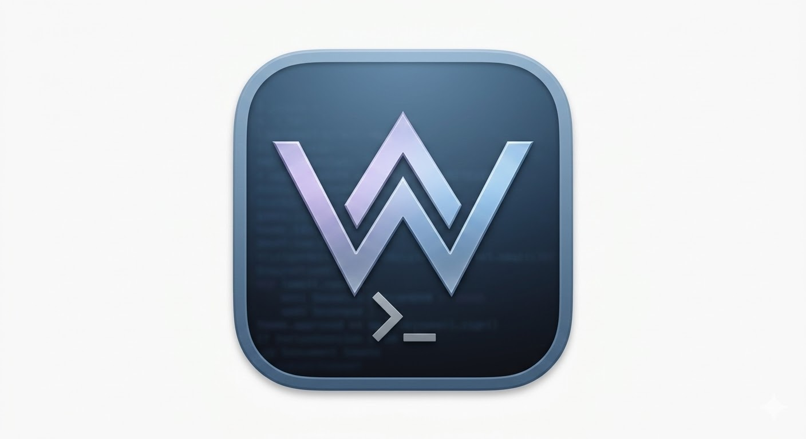

# WinShell

<p align="center">
  
</p>

**WinShell** is a macOS terminal TUI that feels like a Windows **CMD/PowerShell-style** network console.

Built for:
- **Students** in networking classes (NWES/lab environments)
- **Network employees** in organizations that want a familiar Windows command workflow on macOS

WinShell translates familiar commands (`ipconfig`, `tracert`, `systeminfo`, etc.) into macOS-compatible operations and reshapes output to be cleaner, aligned, and easier to read.

---

## Why WinShell?

In many school and enterprise environments, network lessons and runbooks are Windows-first. macOS equivalents (`ifconfig`, raw `scutil`, etc.) are powerful but often noisy and harder to map directly to what people are taught.

WinShell bridges that gap with a familiar command UX.

---

## Windows-style terminal feel

```powershell
Microsoft Windows [Version 10.0.22631.1]
(c) Microsoft Corporation. All rights reserved.

WinShell for macOS - NWES Lab Edition
Type 'help' to list available commands.

C:\> ipconfig /all
```

---

## Features

- Interactive Textual TUI:
  - Header
  - Scrollable output pane
  - Command input prompt
  - Footer shortcuts
- Windows-style command parsing (`ipconfig /all`, `arp -a`, etc.)
- macOS backend adapters for networking/system calls
- Windows-like output formatting for readability
- Unknown command handling with familiar CMD-style error message
- Command history (`↑` / `↓`)
- Extensible architecture for new commands

---

## Supported commands

- `ipconfig`
- `ipconfig /all`
- `ping <host>`
- `tracert <host>`
- `netstat`
- `arp -a`
- `nslookup <host>`
- `hostname`
- `whoami`
- `systeminfo`
- `cls`
- `help`
- `exit`

---

## For users (download & run app)

> This section is for students and network employees who just want to use WinShell.

### Option A (recommended when available)
Download the latest **WinShell.dmg** from Releases, open it, and drag **WinShell.app** into **Applications**.

Then launch from Applications (or Spotlight).

### Option B (run from source now)

```bash
cd /Users/gabriel/.openclaw/workspace/winshell
python3 -m venv .venv
source .venv/bin/activate
pip install -r requirements.txt
python -m winshell
```

### Basic usage

- Type `help` to see commands
- Use `↑` / `↓` for history
- Use `cls` (or `Ctrl+L`) to clear output
- Type `exit` to quit

Example:

```text
ipconfig
ipconfig /all
ping 8.8.8.8
tracert cloudflare.com
systeminfo
```

---

## For developers (contribute)

> This section is for contributors who want to extend WinShell.

### Project structure

```text
winshell/
  winshell/
    tui/           # Textual app and UI behavior
    parser.py      # Windows-like command parsing
    registry.py    # Command routing/execution
    adapters/      # macOS command adapters (subprocess-backed)
    formatters/    # Windows-style output shaping
```

### Dev setup

```bash
cd winshell
python3 -m venv .venv
source .venv/bin/activate
pip install -r requirements.txt
python -m winshell
```

### Contribution guidelines (quick)

- Keep command handlers modular (avoid giant switch blocks)
- Keep adapters platform-safe and subprocess usage minimal/sanitized
- Keep formatter output consistent and classroom-friendly
- Preserve Windows-like UX and error tone
- Add/update tests when introducing new commands and formatters

### Typical extension flow

1. Add parsing behavior (if needed)
2. Add adapter logic (`winshell/adapters/*`)
3. Add formatter output (`winshell/formatters/*`)
4. Register command in `registry.py`
5. Validate in TUI and add tests

---

## Packaging roadmap

Planned release packaging:
- Build `.app` bundle
- Package to signed/notarized `.dmg`
- Publish through GitHub Releases for organization-wide deployment

Icon asset used for app packaging:
- `assets/WinShell.icns`

---

## Notes

- WinShell is **Windows-like**, not a full PowerShell clone.
- Some output is intentionally simplified for training and operational clarity.
- Under the hood, commands are translated to macOS-native tools.
